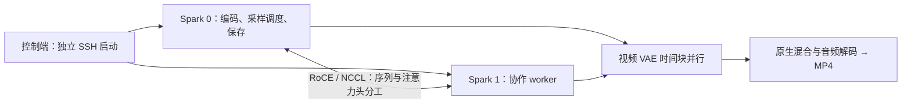

# MiniMax H3 · Dual DGX Spark

[English](README.en.md) · [部署说明](docs/SETUP.md) · [实测报告](results/2026-09-28/RESULTS.md) · [实现与归属](docs/ARCHITECTURE.md)

两台 NVIDIA DGX Spark，通过 RoCE 直连共同完成一条 H3 视频的推理。基于现有 ComfyUI H3 实现，提供隔离运行器、双机启动脚本、数值验证和可核算的测试记录。

**固定测试中，热运行从 104.09 秒降到 46.41 秒：完整生成 2.24×，20 步采样 2.40×。**

> 实验版本。已验证的是 **Ref2VA INT8 ConvRot、832×480、56 帧、20 步、无 LoRA、无参考输入**。计时从提示词编码到 MP4 保存，排除初始模型构造与加载；每组四轮，取后三轮中位数。尚未验证 Singularity 作者双采、LoRA、参考视频、ControlNet 或长片。公共启动封装经过 CPU 测试，未在打包后另跑双机 GPU 回归。

## 实测：1 + 1 > 2 的具体范围

| 阶段 | 单 Spark | 初版双 Spark | 优化双 Spark | 单机 / 优化双机 |
|---|---:|---:|---:|---:|
| 20 步采样 | 95.54 s | 40.82 s | 39.84 s | **2.40×** |
| 视频及音频解码 | 6.15 s | 6.65 s | 4.24 s | **1.45×** |
| 提示词编码 → 文件保存 | 104.09 s | 49.87 s | 46.41 s | **2.24×** |

同一模型、提示词、seed、步数、精度、采样器、分辨率、音视频输出口径。三组共 12 个 MP4 的 SHA256 完全相同；原记录的 12 次完整解码均通过。并行 VAE 与原生 VAE 的同 latent 像素对照为 `exact=true, max_abs=0`。这些结论只覆盖本次输入，不能视为所有输入均逐位一致的保证。

完整逐轮数据、首次运行数据、计时边界和较慢案例见 [2026-09-28 实测报告](results/2026-09-28/RESULTS.md)。这是推理优化，没有训练或修改模型权重。

## 示例输出

[](files/sailboat-832x480-56f.mp4)

[查看 / 下载测试视频（MP4，832×480，56 帧，带生成音频，约 646 KiB）](files/sailboat-832x480-56f.mp4)。示例来自优化双机的第 4 轮；完整 SHA256 与其余 11 轮相同。

## 如何协作



两端各保留一份权重，通过序列并行、QKV 分头和通信分块共同计算；视频 VAE 的时间块也分配到两端。它**没有把两台机器变成透明的 256 GB 统一内存池**。本次连接使用 RoCE，日志为 `NET/IB`、`GDR 0`，不宣称 NVLink 或已实现 GPU Direct RDMA。

运行器在独立 Python 进程里调用现有 ComfyUI 节点与模型代码。它目前是命令行实验后端，不是可直接拖入任意 ComfyUI 工作流的插件。

## 快速开始

前提：两端已有匹配版本的 ComfyUI、Python 环境及模型，直连 RoCE 已配置好。完整清单见 [SETUP](docs/SETUP.md)。本仓库不安装驱动、下载模型、改网络或启动生产服务。

```bash
git clone https://github.com/GaryLauLGY/MinimaxH3-Dual-Dgx-Spark.git
cd MinimaxH3-Dual-Dgx-Spark
cp config.example.json config.local.json
# 编辑 config.local.json：SSH、准确主机名、路径、直连地址、网卡和所有 ComfyUI 端口。

# 纯本地检查：无需 GPU，不联系远端
python3 -m unittest discover -s tests -v
python3 scripts/verify_results.py
python3 scripts/cluster.py run --config config.example.json --run preview --dry-run

# 只读预检；--verify-weights 会读取大模型文件计算 SHA256
python3 scripts/cluster.py validate --verify-weights

# 确认两台没有其他 GPU 工作后，顺序执行，不能同时开跑
python3 scripts/cluster.py run --run link01 --mode link
python3 scripts/cluster.py run --run single01 --world 1
python3 scripts/cluster.py run --run dual01 --parallel-vae
python3 scripts/cluster.py collect --run dual01
```

生成默认参数与表中测试一致：832×480、56 帧、20 步、seed `20260928`、四轮；双机默认 `allgather / attention-chunks=4 / gather-chunks=4`，视频 VAE 并行需显式添加 `--parallel-vae`。每次使用新的 run ID。新控制脚本保留日志，拒绝覆盖旧 run，也不会清空生产队列。

`validate` 核对主机、ComfyUI 提交、相关已跟踪源码改动、模型文件和配置的 ComfyUI 队列，并展示 GPU 进程。它不是全局 GPU 调度锁：开始前仍需确保没有其他任务，运行期间避免提交新任务。

## 本项目做了什么

- 将已有 Ulysses 注意力 / block 原语接入两台独立 Spark，保留当前 ComfyUI 原生 H3 的 embedding、final head 和音频缩放。
- 适配 INT8 ConvRot 分头 QKV 的逐行 scale 与 bias 切片；未知量化布局主动报错。
- 修复当前量化 Parameter 在 `inference_mode` 下的兼容问题，完整测试统一用 `no_grad`。
- 对 all-to-all / all-gather、通信分块、注意力分块做带数值门槛的选择；将原生 VAE 时间块分配到双机，保留原生混合与像素处理。
- 保存同输入单机 / 双机对照、逐轮计时、数值差、视频哈希与技术检查。

Ulysses、通信分块和并行 VAE 的思路已有上游实现。本项目基于 **[buqi-code/buqi-minimax-h3-multigpu](https://github.com/buqi-code/buqi-minimax-h3-multigpu)**；目录和结果展示方式参考 **[MiaAI-Lab 的双 Spark DeepSeek 仓库](https://github.com/MiaAI-Lab/DeepSeek-v4-Flash-DSpark-2x-DGX-Spark)**。我们没有与其他公开 H3 双机项目做同条件横评，也不声称首创。详见 [CREDITS](CREDITS.md)。

## 仓库地图

| 路径 | 内容 |
|---|---|
| [`runtime/`](runtime/) | 已测计算代码及公开化后的运行入口 |
| [`scripts/`](scripts/) | 配置、预检、启动、收集、结果核算 |
| [`docs/SETUP.md`](docs/SETUP.md) | 环境、模型、配置、运行与故障定位 |
| [`docs/ARCHITECTURE.md`](docs/ARCHITECTURE.md) | 数据流、优化来源与限制 |
| [`results/2026-09-28/`](results/2026-09-28/) | 原数值记录、脱敏配置、哈希、报告 |
| [`tests/`](tests/) | 控制端与证据一致性的 CPU 测试 |
| [`AUDIT.md`](AUDIT.md) | 哪些已验证，哪些尚未验证 |

代码采用 MIT；上游版权声明保留在 [licenses/](licenses/)。模型权重不包含在仓库内，其许可由各自发布方规定。
